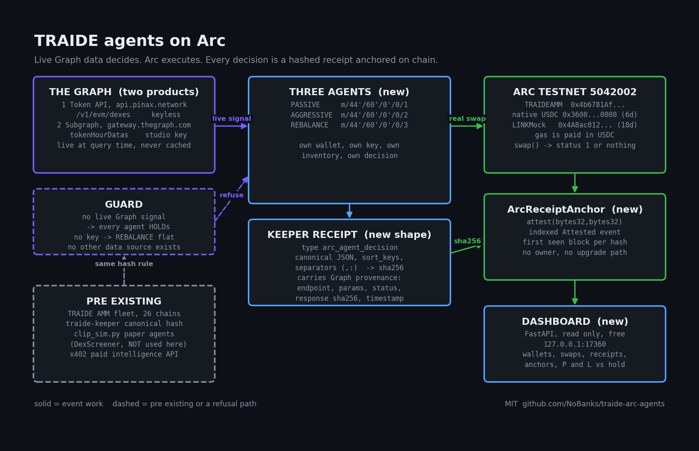

<!--
# CITATION: every market number in this repo is live at query time from The Graph Token API
(https://api.pinax.network; endpoints and their auth requirements read from the live OpenAPI
document at https://api.pinax.network/openapi, spec 3.21.1+af56ff2, on 2026-09-07). Every
chain number is read live from https://rpc.testnet.arc.io and checkable on
https://testnet.arcscan.app. No simulated, projected or cached dataset is used anywhere in
the demo path.
-->

# traide-arc-agents

**Live demo: https://arc-agents.nohumannearby.com**

## JUDGE QUICKSTART

Everything below was run on 2026-09-10 and pasted verbatim. Nothing is trimmed.

### 60 seconds, nothing to install

1. Open **https://arc-agents.nohumannearby.com**. The status line under the title
   is read from the ledger on every load: receipts, real swaps, anchors, last
   decision time, when the ledger started.
2. Pick any row in the **Decision ledger** table. The `receipt sha256` column is
   that row's hash. Its `swap tx` and `anchor tx` links open on
   `testnet.arcscan.app`, both status 1, both sent by that agent's own address.
3. The same row as JSON, no scraping:
   `https://arc-agents.nohumannearby.com/receipt/<sha256>.json`. The whole
   ledger as one document: **https://arc-agents.nohumannearby.com/ledger.json**
   (about 5 MB; `?traded=1&limit=20` for the last twenty trades,
   `?agent=REBALANCE` per agent). Read only, no credential is ever in a receipt.

### 5 minutes, one command that re-derives every claim in a row

No dotenv, no keys, no local data. A fresh clone resolves the hash against the
public export above.

```bash
git clone https://github.com/NoBanks/traide-arc-agents && cd traide-arc-agents
python3.11 -m pip install -r requirements.txt
python3.11 -m scripts.verify_receipt 2d51c783230fe76de2b59fc2d3548840ebb41586a8c9cf23a4b5f985a5f120ee
```

That hash is REBALANCE's first price-tier trade, also committed at
`docs/sample_receipt_price_tier.json`. Any hash from the dashboard works the
same way. Output of that exact command from a clone with no dotenv and no
`data/`, 2026-09-10:

```
receipt 2d51c783230fe76de2b59fc2d3548840ebb41586a8c9cf23a4b5f985a5f120ee
  REBALANCE BUY_LINK cycle 16 at 2026-09-07T21:18:23Z on chain 5042002, engine traide-arc-agents 1.0.0
  source: https://arc-agents.nohumannearby.com/receipt/2d51c783230fe76de2b59fc2d3548840ebb41586a8c9cf23a4b5f985a5f120ee.json
  dashboard: https://arc-agents.nohumannearby.com
[PASS] hash: sha256(canonical JSON) = 2d51c783230fe76de2b59fc2d3548840ebb41586a8c9cf23a4b5f985a5f120ee, matches the ledger's receipt_hash
  rpc: https://rpc.testnet.arc.io (chain id 5042002, head block 61387822)
[PASS] anchor: attestedAt(0x2d51c783230f..) = 1788815904 (2026-09-07T21:18:24Z) on 0x107B82c6.., attestedBy = 0x27e13BC4.. which is the agent's own address
       https://testnet.arcscan.app/address/0x107B82c61E006A962a6C4ec1E9379667B6fa3f09
[PASS] anchor tx: 0x0311a0f9e7b1.. status 1, block 60969453, from the agent, to the anchor contract, Attested event carries this hash
       https://testnet.arcscan.app/tx/0x0311a0f9e7b1fc78a31cac92ce0b372718c0736f622a42eeb9b6a5b6312e54d3
[PASS] swap tx: 0x92ee66575f87.. status 1, block 60969449, from the agent, to TRAIDEAMM 0x4b6781Af.., BUY_LINK amount_in 10000
       https://testnet.arcscan.app/tx/0x92ee66575f8700dc46f156b9041a8d6cef80d8ec78f2d0af1b38b54a562d1b09
[PASS] graph 1/3: thegraph-token-api https://api.pinax.network/v1/evm/dexes params {"network": "base"}
       recorded 2026-09-07T21:18:05Z HTTP 200, 1927 bytes, sha256 570bb047e39d..; live response now HTTP 200, 1927 bytes, sha256 91a25ab61741..: live data has moved since 2026-09-07T21:18:05Z, which is expected for a live index. The recorded hash pins what the agent saw and the anchor pins when
[SKIP] graph 2/3: thegraph-subgraph-gateway https://gateway.thegraph.com/api/subgraphs/id/5zvR82QoaXYFyDEKLZ9t6v9adgnptxYpKpSbxtgVENFV variables {"sym": "LINK"}
       recorded 2026-09-07T21:17:41Z HTTP 200, 846 bytes, sha256 7e7e1952e7ef..; not re-run: needs GRAPH_GATEWAY_API_KEY in the environment to re-run
[SKIP] graph 3/3: thegraph-subgraph-gateway https://gateway.thegraph.com/api/subgraphs/id/5zvR82QoaXYFyDEKLZ9t6v9adgnptxYpKpSbxtgVENFV variables {"n": 24, "tid": "0x514910771af9ca656af840dff83e8264ecf986ca"}
       recorded 2026-09-07T21:18:04Z HTTP 200, 6376 bytes, sha256 3914ec12e70d..; not re-run: needs GRAPH_GATEWAY_API_KEY in the environment to re-run
[PASS] guard: decision traded on Graph tier "price"; a swap on tier "none" would fail here
RESULT: 6 PASS, 0 FAIL, 2 SKIP
```

What each line proved: the sha256 was recomputed from the canonical JSON with the
traide-keeper rule; `attestedAt` and `attestedBy` were read from
`ArcReceiptAnchor` by `eth_call` and the attester is the agent's own address;
the anchor transaction and the swap transaction were re-fetched from Arc with
status 1, from the agent, to the right contract, in the recorded block; the
Token API call was re-issued live (the recorded hash pins what the agent saw,
the live hash shows the index has moved since); the two gateway calls are
skipped without a Subgraph Studio key and re-run when `GRAPH_GATEWAY_API_KEY`
is set. Pass `--no-graph` to skip the live re-runs entirely, or
`docs/sample_receipt_price_tier.json` as the target to verify the committed file.

Then the whole ledger, every receipt hash, every swap and every anchor, from the
same clone:

```
$ python3.11 -m scripts.verify
ledger: https://arc-agents.nohumannearby.com/ledger.json
[PASS] ledger: 2196 receipts, 0 hash mismatches, 0 chain breaks
[PASS] swaps: 589 refetched from Arc, 0 not status 1, 0 could not be fetched after 3 attempts
[PASS] anchors: 589 anchored, contract total() 589, 0 hashes absent on chain
[PASS] graph: 0 receipts with a tier but no provenance, 0 swaps made without a Graph tier

Graph endpoints that actually decided these trades:
  https://api.pinax.network/v1/evm/dexes
  https://api.pinax.network/v1/evm/pools
  https://gateway.thegraph.com/api/subgraphs/id/5zvR82QoaXYFyDEKLZ9t6v9adgnptxYpKpSbxtgVENFV

anchor contract: https://testnet.arcscan.app/address/0x107B82c61E006A962a6C4ec1E9379667B6fa3f09
ALL CHECKS PASSED
```

Run either script against your own download with `--ledger <file or URL>`.
Both exit 0 only when nothing failed. `python3.11 -m pytest` runs the 22 tests.

Three autonomous agents, each with its own funded wallet, trading a real pair on
Arc testnet. Every trade is decided by data pulled from The Graph at decision
time, recorded as a canonical keeper receipt, and anchored on Arc.

The agents compose **two Graph products**: the Token API for market activity and
the **official Uniswap v3 subgraph** through the decentralized network gateway for
reference price. Each receipt records which product produced which number.

Uniswap stack usage and feedback: [FEEDBACK.md](FEEDBACK.md).

Built for ETHOnline 2026, Continuity track. TRAIDE is pre-existing work and this
repo is the event work. The split is spelled out below, line by line.



*Regenerate with `python3.11 -m scripts.make_architecture_png`. It is drawn from code so it can
be updated when the system changes, rather than being a screenshot nobody can edit.*

## Documents

| Document | What it is |
|---|---|
| [FEEDBACK.md](FEEDBACK.md) | Feedback to the Uniswap Foundation: what we built on the Uniswap v3 subgraph, what worked, four concrete documentation and tooling suggestions, and a v2-fork finding that breaks every fork running OpenZeppelin 5 |
| [docs/UNISWAP_FEEDBACK_FORM_ANSWERS.md](docs/UNISWAP_FEEDBACK_FORM_ANSWERS.md) | Every field of the Uniswap Developer Feedback Form with drafted plain-text answers, ready to paste. Not submitted |
| [docs/PRIZE_EVIDENCE.md](docs/PRIZE_EVIDENCE.md) | Each prize requirement quoted from the ETHOnline prizes page, mapped to a file path, address or tx hash. Includes the PRE-EXISTING versus NEW disclosure and an honest open-items list |
| [docs/MAINNET_READY.md](docs/MAINNET_READY.md) | The config-only path to Arc mainnet, what must not change, gas budget, and a preflight checklist. States up front that nothing is verified on mainnet because mainnet is not live until Sep 16 |
| [docs/sample_receipt_price_tier.json](docs/sample_receipt_price_tier.json) | A real decision receipt composing both Graph products, with its swap and anchor transactions |
| [scripts/verify_receipt.py](scripts/verify_receipt.py) | One command verifies one receipt end to end: hash, on-chain anchor and attester, anchor tx, swap tx, live re-run of its Graph calls. See JUDGE QUICKSTART |
| [/ledger.json](https://arc-agents.nohumannearby.com/ledger.json) | The whole hash-chained ledger as one public JSON document, byte-true per row, served by the dashboard |
| [docs/graph_activity_baseline.json](docs/graph_activity_baseline.json) | The raw measurement windows behind the activity signal's calibration constant |

## The one rule that matters

The Graph is load bearing. If the Graph call fails, the agents do not trade. They
log the refusal and skip the cycle. There is no fallback data source anywhere in
this program. DexScreener, which the pre-existing paper agent uses, is not
imported, not called, and not reachable from this code path.

The refusal is not a claim, it is a run:

```
$ GRAPH_ALLOW_KEYLESS=0 python3.11 -m arc_agents.runner --once --dry-run
cycle 1: Graph tier=none calls=0
  [GRAPH] no API key, not trading
  keyless activity tier disabled by GRAPH_ALLOW_KEYLESS=0
  no usable Graph signal, every agent holds this cycle
  PASSIVE: HOLD - [GRAPH] no API key, not trading
  AGGRESSIVE: HOLD - [GRAPH] no API key, not trading
  REBALANCE: HOLD - [GRAPH] no API key, not trading
```

## PRE-EXISTING, not event work

Documented here because the Continuity track requires it. None of this was built
during ETHOnline 2026 and none of it is claimed as event work.

| Thing | Where | What it is |
|---|---|---|
| TRAIDE AMM contract fleet | TRAIDE monorepo, deployed on 26 chains | Uniswap-v2-style AMM. The Arc testnet deploy of this fleet happened on 2026-09-07, immediately before this repo existed. |
| TRAIDEAMM on Arc | `0x4b6781AfC7e91D65acdD37a424D7A43f170f9120` | The venue these agents trade on. Deployed and source-verified before this repo was created. |
| traide-keeper | separate repo | Receipt canonicalization and on-chain attestation. This repo reuses its hashing rule exactly, and does not fork it. |
| clip_sim.py paper agents | TRAIDE agent backend | Four paper-trading agents priced from DexScreener. Referenced only to say what this is not: those agents do not touch a chain, and their data source is deliberately absent here. |
| x402 paid intelligence API | TRAIDE agent backend | Paid endpoints on Base. Mentioned for completeness. This repo serves free routes only. |

## NEW, built during ETHOnline 2026

Everything in this repository. Specifically:

- `arc_agents/graph.py`, the Graph client, its two tiers, its provenance record
  and the refusal guard.
- `arc_agents/agents.py`, three strategies whose decision input is a Graph signal.
- `arc_agents/wallets.py`, deterministic per-agent wallets from one gitignored seed.
- `arc_agents/chain.py`, the Arc client that refuses to report a transaction it
  has not re-read with status 1.
- `arc_agents/receipts.py`, a NEW receipt shape, `arc_agent_decision`, carrying
  Graph provenance. The canonicalization rule is the pre-existing traide-keeper
  rule, unchanged.
- `contracts/ArcReceiptAnchor.sol` and `arc_agents/anchor.py`, on-chain anchoring.
- `arc_agents/dashboard.py`, the read-only FastAPI view.
- `scripts/`, the setup, seed and diagram tooling.

## How The Graph is used

Both tiers hit The Graph's Token API, which runs at `api.pinax.network` under The
Graph brand. Every path below and its authentication requirement was read from
the live OpenAPI document at `https://api.pinax.network/openapi` on 2026-09-07
(spec version 3.21.1+af56ff2). Nothing is guessed.

### Tier 1, activity. Keyless, verified against the running service.

```
GET https://api.pinax.network/v1/evm/dexes?network=base
Accept: application/json
```

The OpenAPI spec carries no `security` block on this path, and an unauthenticated
call returns HTTP 200:

```
$ curl -s -o /dev/null -w "%{http_code}\n" "https://api.pinax.network/v1/evm/dexes?network=base"
200
```

The response gives, per DEX factory on the network, a cumulative `transactions`
count, a `uaw` unique-active-wallet count, and a `last_activity` timestamp.
Polling it once per cycle and differencing gives a transaction rate as of that
moment. The agents trade the deviation of that rate from a measured steady state,
not the level.

The steady state was measured, not assumed. Four unauthenticated polls sixty
seconds apart on 2026-09-07 gave 10.83, 8.24 and 9.85 transactions per second
across the three windows, mean 9.64. The raw windows are committed at
`docs/graph_activity_baseline.json` and the constant lives at
`graph.BASE_ACTIVITY_TX_PER_SECOND`.

### Tier 2, price. A Subgraph through the decentralized network gateway.

This is the second Graph product, and it needs a **Subgraph Studio query API
key** in `GRAPH_GATEWAY_API_KEY`.

```
POST https://gateway.thegraph.com/api/subgraphs/id/<SUBGRAPH_ID>
Authorization: Bearer <GRAPH_GATEWAY_API_KEY>
Content-Type: application/json
```

The documented path form `https://gateway.thegraph.com/api/<API_KEY>/subgraphs/id/<ID>`
works too. This repo sends the bearer form so the key never appears in a URL and
therefore never lands in a log line or a receipt.

The query, run once per cycle:

```graphql
query ReferencePrice($tid: String!, $n: Int!) {
  bundles(first: 1) { ethPriceUSD }
  tokenHourDatas(
    where: {token: $tid}
    orderBy: periodStartUnix
    orderDirection: desc
    first: $n
  ) { periodStartUnix open high low close priceUSD }
  _meta { block { number } hasIndexingErrors }
}
```

Every field was verified against the authoritative Uniswap v3 schema at
`github.com/Uniswap/v3-subgraph` (branch `dev`, `schema.graphql`, fetched
2026-09-07): `Bundle.ethPriceUSD`, `TokenHourData.periodStartUnix/open/high/low/close/priceUSD`
and `Token.id/symbol/name/derivedETH/volumeUSD` all exist as used.

Neither the subgraph nor the reference token is hardcoded to a guess:

- The **subgraph id** is resolved by probing a list of candidates, each sourced
  from a Graph Explorer subgraph page or Uniswap's developer docs, and keeping
  the first that answers with data. Pin one with `GRAPH_SUBGRAPH_ID`.
- The **reference token** is resolved *by symbol* from live subgraph data
  (`tokens(where: {symbol: "LINK"}, orderBy: volumeUSD, orderDirection: desc)`),
  preferring the highest-volume match whose name looks like Chainlink. No token
  contract address is written into this repo, so no address in it can be wrong.

Two transport facts learned by probing the live gateway, both worth knowing
before anyone reimplements this:

1. A request without a browser-shaped `User-Agent` is refused by Cloudflare with
   `error code: 1010` before it ever reaches The Graph. Python's `urllib`
   default triggers this. The client always sends an explicit one.
2. A key the gateway does not recognize comes back **HTTP 200** with a GraphQL
   error body, not a 401:
   `{"errors":[{"message":"auth error: API key not found"}]}`. So status code
   alone is not a success test, and the guard inspects the body.

#### Why not the Token API for price

The Token API's price endpoints (`/v1/evm/pools`, `/v1/evm/pools/ohlc`,
`/v1/evm/swaps`) all carry `security: [{bearerAuth: []}]` and refuse an
unauthenticated call:

```
$ curl -s "https://api.pinax.network/v1/evm/pools?network=base&limit=1"
{"error":{"status":401,"code":"unauthorized"}}
```

They also refuse a Subgraph Studio key, verified 2026-09-07, because the Token
API is a separate service wanting a Pinax-issued JWT: `token-api.thegraph.com`
resolves as a CNAME to `token-api.service.pinax.network`. So with a Studio key in
hand, the honest route to a price is a subgraph. If a Pinax JWT is ever set in
`GRAPH_API_KEY` as well, the client will use the Token API price endpoints as a
second route automatically.

Either way, there is no keyless route to a reference price. That is why the
REBALANCE agent, whose whole strategy is a value split and therefore needs a
price, stands down until the price tier is live. One agent that literally cannot
act without The Graph is the clearest demonstration of load-bearing this repo can
offer, and it is visible in the ledger: REBALANCE held on every cycle until the
gateway key worked, then traded on the first cycle that carried a price.

#### Live, verified 2026-09-07

```
subgraph tier: resolved 5zvR82QoaXYFyDEKLZ9t6v9adgnptxYpKpSbxtgVENFV
subgraph tier: reference token LINK (ChainLink Token) resolved by symbol from
               live data, address 0x514910771af9ca656af840dff83e8264ecf986ca
subgraph tier: 24 hourly closes, ETH reference 2490.675326884083227389169746640452
price tier live from subgraph 5zvR82QoaXYF.. via gateway, 24 closes
composed two Graph products: thegraph-subgraph-gateway, thegraph-token-api
REBALANCE: BUY_LINK - LINK share 0.190, target 0.406 from the Graph price tier
           (-1.87 percent), drift -0.216
```

REBALANCE's first real trade, both legs checkable on chain:

| Item | Value |
|---|---|
| Swap tx | [0x92ee6657...](https://testnet.arcscan.app/tx/0x92ee66575f8700dc46f156b9041a8d6cef80d8ec78f2d0af1b38b54a562d1b09) status 1, block 60969449 |
| Receipt sha256 | `2d51c783230fe76de2b59fc2d3548840ebb41586a8c9cf23a4b5f985a5f120ee` |
| Anchor tx | [0x0311a0f9...](https://testnet.arcscan.app/tx/0x0311a0f9e7b1fc78a31cac92ce0b372718c0736f622a42eeb9b6a5b6312e54d3) |
| `attestedAt` | 1788815904, nonzero, so the hash is on chain |

The full receipt, with both products' provenance, is committed at
`docs/sample_receipt_price_tier.json`. The API key appears nowhere in it.

#### Three things probing the live gateway taught us

Recorded because anyone reimplementing this will hit them:

1. **The token scan is slow.** Ordering every token by `volumeUSD` measured
   **10.9 seconds** against a cold gateway. At a 15 second budget that surfaced
   as a phantom "no token with symbol LINK". Subgraph calls get 60 seconds.
2. **`_meta` is not a compatibility test.** Candidate `A3Np3RQb..` answers
   `_meta` happily and then fails the real query with
   ``Type `Token` has no field `volumeUSD` ``. The resolver therefore probes with
   the query it actually depends on, so a wrong-schema deployment is rejected
   rather than selected and failed later.
3. **A dead subgraph id returns HTTP 200.** Two candidates answer
   `{"errors":[{"message":"subgraph not found: ..."}]}` with a 200. Same lesson
   as the auth error: never trust the status code alone.

### Provenance in every receipt

Every Graph call records the endpoint, the exact query parameters, whether it was
authenticated, the HTTP status, the sha256 of the exact response bytes, the byte
count, and the fetch timestamp. That block is embedded in the receipt that is
hashed and anchored, so a verifier can prove which Graph response the decision
was made from. The API key itself is never logged, never written to a receipt,
and never returned by any function.

A real receipt from a real cycle is committed at `docs/sample_receipt.json`, with
its swap transaction and its anchor transaction beside it. The running ledger is
at `data/receipts.jsonl`, exported whole at `/ledger.json` and one row at a time
at `/receipt/<sha256>.json`.

## The agents

| Agent | Derivation path | Strategy | Graph tier it needs |
|---|---|---|---|
| PASSIVE | `m/44'/60'/0'/0/1` | Contrarian. Buys weakness, sells strength, always the smallest size. | activity or price |
| AGGRESSIVE | `m/44'/60'/0'/0/2` | Trend follower. Size scales with signal strength. | activity or price |
| REBALANCE | `m/44'/60'/0'/0/3` | Holds a target split by pool value, leaning with the reference price. | price only, so it is flat until the Subgraph tier is live |

Wallets are BIP-44 children of one BIP-39 mnemonic held only in the gitignored
dotenv file. The paths are public because a path is not a secret; the mnemonic
never leaves the operator's machine and no private key is printed, logged or
serialized anywhere in this repo.

## Chain facts

| Fact | Value |
|---|---|
| Chain | Arc testnet, id 5042002 |
| RPC | `https://rpc.testnet.arc.io` |
| Explorer | `https://testnet.arcscan.app` |
| Gas token | USDC. Gas and the quote asset are the same asset. |
| Native USDC ERC-20 view | `0x3600000000000000000000000000000000000000`, 6 decimals |
| Second leg | LINKMock `0x4A8ac01265a030Aad32fb9B7bD5f89Be18f21858`, 18 decimals |
| Swap venue | TRAIDEAMM `0x4b6781AfC7e91D65acdD37a424D7A43f170f9120` |
| Anchor | ArcReceiptAnchor, address in `deployments/arc-5042002.json` |

Two Arc-specific facts this code is built around, both found by exercising the
chain rather than reading docs:

1. `eth_getBalance` reports the USDC balance at 18 decimals while `balanceOf`
   reports the same balance at 6. They differ by exactly `10**12`. Mixing them
   is an off-by-a-trillion bug, so `chain.py` names every quantity by its scale.
2. Swaps go through TRAIDEAMM, not the Factory/Router/Pair path. `TRAIDEPair`
   mints `MINIMUM_LIQUIDITY` to `address(0)`, which OpenZeppelin 5 reverts with
   `ERC20InvalidReceiver`, so a TRAIDE pair cannot take first liquidity on any
   chain. TRAIDEAMM keeps LP shares in its own mapping and never touches the
   zero address. The Factory pair exists on Arc and is left in place as the
   evidence trail rather than hidden.

## Anchoring, and why a contract instead of a memo

Both options were on the table. A self transfer carrying the receipt hash as
calldata is cheaper, but it leaves nothing queryable: a verifier would have to
scan every transaction the agent ever sent to find the anchors.
`ArcReceiptAnchor` costs a little more gas and gives three things a memo cannot:

- an indexed `Attested(attester, receiptHash, agent, timestamp)` event a verifier
  can filter, per agent, with one `eth_getLogs`
- a first-seen block per hash, so a receipt cannot be backdated
- a running `total()` the dashboard reads with one `eth_call`

At 25 gwei on Arc an anchor costs roughly 0.0015 USDC, so the extra cost is not a
real constraint. The contract has no owner, no admin and no upgrade path. Anyone
may attest. The agent that made the decision is the address that signs its own
anchor, so the evidence does not come from a shared operator account.

## Running it

```bash
python3.11 -m pip install -r requirements.txt

cp .env.example .env             # then fill it in, it is gitignored
python3.11 -m scripts.new_seed   # prints a fresh mnemonic, paste it into the dotenv

python3.11 -m scripts.setup_arc --plan   # show what it would do, send nothing
python3.11 -m scripts.setup_arc          # liquidity, funding, anchor deploy

python3.11 -m arc_agents.runner --once --dry-run   # decide, send nothing
python3.11 -m arc_agents.runner --once             # one real cycle
python3.11 -m arc_agents.runner                    # forever

python3.11 -m arc_agents.dashboard   # http://127.0.0.1:17360/
```

The dashboard is published at **https://arc-agents.nohumannearby.com** through a
Cloudflare tunnel (PM2 app `traide-arc-agents-tunnel`). It is read only and
serves free routes only. Routes: `/` (HTML), `/ledger.json` (whole ledger,
`?limit=`, `?traded=1`, `?agent=`), `/receipt/<sha256>.json`, `/api/state`,
`/api/receipts`, `/api/verify`, `/healthz`.

Unattended, under PM2, with the crash-loop guards this house requires
(`max_restarts`, `min_uptime`, exponential backoff, logs in `~/.pm2/logs`):

```bash
pm2 start ecosystem.config.js && pm2 save
pm2 logs arc-agents-runner --lines 50 --nostream
```

## Verifying the receipts yourself

Two commands, no need to trust the dashboard or this README. Both read
`data/receipts.jsonl` when it exists and fall back to the public `/ledger.json`
export when it does not, so they work from a fresh clone.

One receipt, every claim in it re-derived, with the explorer URL per check:

```bash
python3.11 -m scripts.verify_receipt <receipt sha256>
python3.11 -m scripts.verify_receipt docs/sample_receipt_price_tier.json
```

The whole ledger:

```
$ python3.11 -m scripts.verify
ledger: https://arc-agents.nohumannearby.com/ledger.json
[PASS] ledger: 2196 receipts, 0 hash mismatches, 0 chain breaks
[PASS] swaps: 589 refetched from Arc, 0 not status 1, 0 could not be fetched after 3 attempts
[PASS] anchors: 589 anchored, contract total() 589, 0 hashes absent on chain
[PASS] graph: 0 receipts with a tier but no provenance, 0 swaps made without a Graph tier

Graph endpoints that actually decided these trades:
  https://api.pinax.network/v1/evm/dexes
  https://api.pinax.network/v1/evm/pools
  https://gateway.thegraph.com/api/subgraphs/id/5zvR82QoaXYFyDEKLZ9t6v9adgnptxYpKpSbxtgVENFV

anchor contract: https://testnet.arcscan.app/address/0x107B82c61E006A962a6C4ec1E9379667B6fa3f09
ALL CHECKS PASSED
```

It recomputes every receipt hash from its own canonical bytes, walks the
prev-hash chain, refetches every swap transaction from Arc (three attempts each,
and it reports "could not be fetched" separately from "reverted"), calls
`attestedAt(bytes32)` on the anchor contract for every anchored hash and
requires a nonzero first-seen timestamp, and confirms no swap was ever made
without a usable Graph tier. Full output of both scripts from a clone with no
local data is pasted under JUDGE QUICKSTART at the top.

The dashboard exposes the first check on its own at
`curl -s https://arc-agents.nohumannearby.com/api/verify`.

## Deployment ready on Arc mainnet

Everything that differs between testnet and mainnet is configuration, not code:

- [ ] `ARC_RPC_URL` and `config.CHAIN_ID` point at Arc mainnet. Public launch is
      2026-09-16. The mainnet chain id circulating third hand is 5042 and it is
      NOT confirmed against Arc's own docs, so this repo does not configure it.
- [ ] `config.USDC` is Arc mainnet's native USDC address, read from chain, not
      assumed to be the same predeploy.
- [ ] `config.TRAIDE_AMM` is the mainnet fleet's AMM. The fleet deploys to the
      same CREATE2 addresses on every chain, so this is a lookup, not a rewrite.
- [ ] The second leg is a real asset, not a mock.
- [ ] `ArcReceiptAnchor` redeployed on mainnet and `deployments/` updated.
- [ ] Swap sizes revisited. Mainnet gas is real USDC.

No contract change and no code change is required for any of the above.

## License

MIT. See LICENSE.
